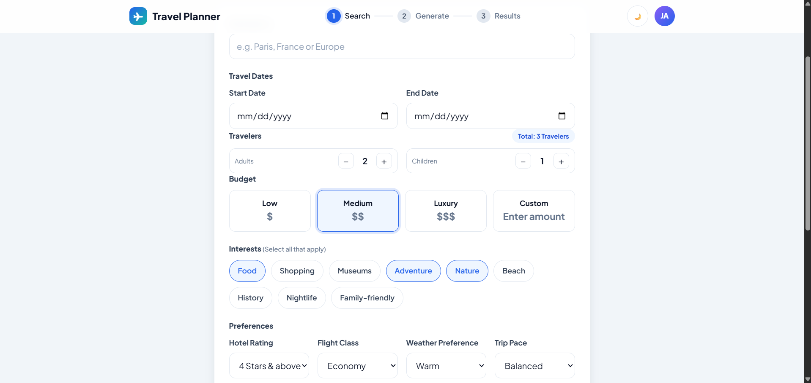
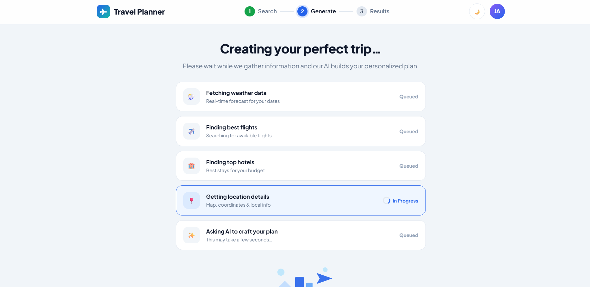
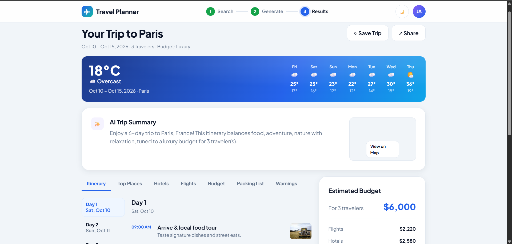

# ✈️ Travel Planner

> A 3-step AI-powered travel planning app built with **pure JavaScript** — no frameworks, no bundlers.
> Enter your trip details, watch live APIs fetch real weather and location data, then receive a complete personalized travel plan.

🔗 **Live Demo:** [randommoaz.github.io/Travel-App](https://randommoaz.github.io/Travel-App/)

---

## 📸 Screenshots

### 🔍 Step 1 — Search



### ⚙️ Step 2 — Generate



### 🗺️ Step 3 — Results



---

## ✨ Features

- 🔍 **Step 1 — Search:** destination autocomplete, date validation, traveler counts, budget tiers, interest chips, and preferences
- ⚙️ **Step 2 — Generate:** parallel API calls with a live task progress list
- 🗺️ **Step 3 — Results:** tabbed view with itinerary, top places, hotels, flights, budget breakdown, packing list, and warnings
- 🌦️ **Live Weather:** real forecast banner with 7-day outlook
- 📍 **Map Integration:** geocoded location with static map thumbnail and OpenStreetMap link
- 💾 **Saved Trips:** persisted in IndexedDB (localStorage fallback), listed reactively on the search page
- 🌙 **Dark / Light theme** with localStorage persistence
- 📱 **Fully responsive** down to 375px

---

## 🗂️ Project Structure

```text
js/
  app.js                   — entry point, router wiring, theme toggle
  config.js                — API keys and strategy flags (git-ignored)
  models/trip.model.js     — Trip class + createTrip factory + AI prompt builder
  store/trip.store.js      — Observable state store (Observer pattern)
  router/router.js         — SPA router using History API
  services/
    ai.service.js          — prompt builder, cache + retry-queue, strategy factory
    weather.service.js     — Open-Meteo forecast API
    geo.service.js         — Open-Meteo geocoding + static map helpers
    travel.service.js      — mock flight and hotel adapters
  strategies/
    ai.strategy.js         — Mock / OpenAI / Gemini strategy classes
  algorithms/ranking.js    — hotel scoring, flight sorting, activity filtering, place ranking
  structures/structures.js — TTLCache (Map-backed), RetryQueue, uniqueBy (Set-backed)
  utils/
    utils.js               — el(), $(), debounce, toast, fmtRange, hashKey
    validators.js          — trip form validation
    storage.js             — IndexedDB + localStorage trip persistence
  views/
    search.view.js         — Step 1 form + saved trips section
    generate.view.js       — Step 2 loading pipeline
    result.view.js         — Step 3 tabbed results
styles/
  main.css                 — tokens, layout, topbar, stepper, responsive base
  components.css           — buttons, cards, fields, grids, chips, tabs
  views.css                — per-view styles, weather banner, result panels
tests/
  harness.js               — minimal test runner
  run.test.js              — unit tests
```

---

## 🎨 Design Patterns

### 👁️ Observer / PubSub

`tripStore` holds all app state. Any module calls `tripStore.subscribe(fn)` to react to changes. The search view uses this to re-render the saved trips list the moment a trip is saved — no manual DOM updates needed.

```js
const unsub = tripStore.subscribe((state) => {
  if (!list.isConnected) { unsub(); return; } // auto-cleanup on unmount
  renderCards(state.savedTrips);
});
```

### 🏭 Factory Pattern

`makeAiStrategy()` reads `CONFIG.aiStrategy` and returns the correct strategy instance. The rest of the app never imports strategy classes directly.

```js
export function makeAiStrategy(which = CONFIG.aiStrategy) {
  switch (which) {
    case "openai": return new OpenAiStrategy(CONFIG.ai.openai);
    case "gemini": return new GeminiStrategy(CONFIG.ai.gemini);
    default:       return new MockAiStrategy();
  }
}
```

### 🔄 Strategy Pattern

Three interchangeable AI providers implement the same `generate({ payload, prompt })` interface:

| Strategy | When used |
| -------- | --------- |
| `MockAiStrategy` | Default — deterministic, offline, schema-correct |
| `OpenAiStrategy` | When `aiStrategy = "openai"` and a key is provided |
| `GeminiStrategy` | When `aiStrategy = "gemini"` and a key is provided |

Switch providers by changing one line in `config.js` — zero changes elsewhere.

---

## 🧱 Data Structures

### 🗺️ Map — TTLCache

Wraps a native `Map` with per-entry TTL expiry. Used in all services to avoid re-fetching within 30 minutes.

### 🔵 Set — Interests & uniqueBy

Interest selection uses a `Set` for O(1) toggle. `uniqueBy()` deduplicates any array by key using a `Set`.

### 📋 Queue — RetryQueue

A FIFO async queue that retries failed tasks with exponential backoff. Wraps AI API calls so transient failures are handled automatically.

---

## 📐 Algorithms

| Function | Description |
| -------- | ----------- |
| `scoreHotel(hotel, budgetTier)` | Weighted score (0–1): rating × 0.5 + price fit × 0.35 + reviews × 0.15 |
| `sortHotels(hotels, budgetTier)` | Sorts hotels by descending score for the chosen budget tier |
| `sortFlights(flights, by)` | Sorts by price, duration, or a blended "best" score |
| `filterActivities(activities, interests)` | Keeps only activities matching selected interests |
| `rankPlaces(places, { interests, weather })` | Boosts beach/nature in warm weather; museums/history in cold or rainy conditions |

---

## 🌐 APIs

| Data | Provider | Status |
| ---- | -------- | ------ |
| 🌦️ Weather forecast | [Open-Meteo](https://open-meteo.com) | ✅ Live — free, no key required |
| 📍 Geocoding / coordinates | [Open-Meteo Geocoding](https://open-meteo.com/en/docs/geocoding-api) | ✅ Live — free, no key required |
| ✈️ Flights | Built-in mock adapter | 🔧 Mock |
| 🏨 Hotels | Built-in mock adapter | 🔧 Mock |
| 🤖 AI trip plan | MockAiStrategy (default) | 🔧 Mock / 🔑 OpenAI & Gemini optional |

---

## 🚀 Setup

```bash
# 1. Clone the repo
git clone https://github.com/RandomMoaz/Travel-App.git
cd Travel-App

# 2. Copy the config template
cp config.example.js config.js

# 3. (Optional) Add real AI keys and set aiStrategy in config.js

# 4. Open with VS Code Live Server or any static server
npx serve .
```

> ⚠️ `config.js` is git-ignored. Never commit real API keys.

---

## 🧪 Running Tests

```bash
node --experimental-vm-modules tests/run.test.js
```

Covers: form validators · hotel/flight ranking · activity filtering · place ranking · mock adapters · trip model · AI prompt builder

---

## 🧠 Advanced JS Concepts Applied

| Concept | Where |
| ------- | ----- |
| 🧩 OOP & Modular JS | services, models, strategies, views — each in its own module |
| ⚡ Async / Await + Promise.all | `generate.view.js` — weather, flights, hotels fetched in parallel |
| 🔀 SPA + History API routing | `router/router.js` |
| 👁️ Observer / PubSub | `store/trip.store.js` + `search.view.js` subscribe |
| 🏭 Factory Pattern | `makeAiStrategy()` in `ai.service.js` |
| 🔄 Strategy Pattern | `MockAiStrategy`, `OpenAiStrategy`, `GeminiStrategy` |
| 🗺️ Map | `TTLCache` in `structures/structures.js` |
| 🔵 Set | Interest selection + `uniqueBy()` |
| 📋 Queue | `RetryQueue` with backoff in `structures/structures.js` |
| 📊 Sorting & Filtering | `algorithms/ranking.js` |
| ⏱️ Debounce | Destination autocomplete in `search.view.js` |
| 💾 Request caching | `TTLCache` used in all services |
| 🦥 Lazy rendering | Result tab panels built on first click only |
| 📦 Offline storage | IndexedDB + localStorage fallback in `utils/storage.js` |
| ✅ Unit testing | `tests/run.test.js` with custom harness |
